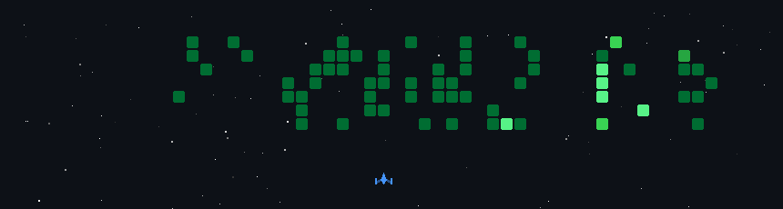

<h1 align="center">Hi 👋, I'm Shivam Rai</h1>
<h3 align="center">Frontend Developer | Drone Technology & 3D Design Enthusiast | India</h3>

- Freestyle Drone Development **Autonomous quadcopter using Pixhawk, GPS, and obstacle avoidance**

- 🌱 I’m currently learning **MERN Stack (MongoDB, Express, React, Node.js) Advanced JavaScript Cybersecurity Basics 3D Procedural Design in Blender**

- Web Applications & Drone-Based Projects **Frontend interfaces, control dashboards, visualization tools**

- 👨‍💻 All of my projects are available at [https://techwithshivam.in/](https://techwithshivam.in/)

- 💬 Ask me about **React, JavaScript, Frontend Development, Drones, Blender**

- 📫 How to reach me **shivamrai83170@gmail.com**

- ⚡ Fun fact **I design drones, debug code, and break things—then fix them properly.**

<h3 align="left">Connect with me:</h3>

  

<h3 align="center">My GitHub Activity Game</h3>

  

 

  

<h3 align="left">Languages and Tools:</h3>

